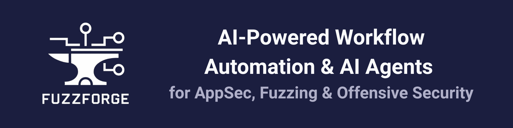

<p align="center">
  
</p>
<h1 align="center">🚧 Crashwise is under active development</h1>

<p align="center"><strong>AI-powered workflow automation and AI Agents for AppSec, Fuzzing & Offensive Security</strong></p>

<p align="center">
  <a href="https://discord.gg/8XEX33UUwZ"></a>
  <a href="LICENSE"></a>
  <a href="https://www.python.org/downloads/"></a>
  <a href="https://crashwise.ai"></a>
  
  <a href="https://github.com/YahyaToubali/Crashwise/stargazers"></a>
  
</p>

<p align="center">
  <sub>
    <a href="#-overview"><b>Overview</b></a>
    • <a href="#-key-features"><b>Features</b></a>
    • <a href="#-installation"><b>Installation</b></a>
    • <a href="#-quickstart"><b>Quickstart</b></a>
    • <a href="#ai-powered-workflow-execution"><b>AI Demo</b></a>
    • <a href="#-contributing"><b>Contributing</b></a>
    • <a href="#%EF%B8%8F-roadmap"><b>Roadmap</b></a>
  </sub>
</p>

---

## 🚀 Overview

**Crashwise** helps security researchers and engineers automate **application security** and **offensive security** workflows with the power of AI and fuzzing frameworks.

- Orchestrate static & dynamic analysis
- Automate vulnerability research
- Scale AppSec testing with AI agents
- Build, share & reuse workflows across teams

Crashwise is **open source**, built to empower security teams, researchers, and the community.

> 🚧 Crashwise is under active development. Expect breaking changes.
>
> **Note:** Fuzzing workflows (`atheris_fuzzing`, `cargo_fuzzing`, `ossfuzz_campaign`) are in early development. OSS-Fuzz integration is under heavy active development. For stable workflows, use: `security_assessment`, `gitleaks_detection`, `trufflehog_detection`, or `llm_secret_detection`.

---

## Demo - Manual Workflow Setup


_Setting up and running security workflows through the interface_

👉 More installation options in the [Documentation](https://docs.crashwise.ai).

---

## ✨ Key Features

- 🤖 **AI Agents for Security** – Specialized agents for AppSec, reversing, and fuzzing
- 🛠 **Workflow Automation** – Define & execute AppSec workflows as code
- 📈 **Vulnerability Research at Scale** – Rediscover 1-days & find 0-days with automation
- 🔗 **Fuzzer Integration** – Atheris (Python), cargo-fuzz (Rust), OSS-Fuzz campaigns
- 🌐 **Community Marketplace** – Share workflows, corpora, PoCs, and modules
- 🔒 **Enterprise Ready** – Team/Corp cloud tiers for scaling offensive security

---

## ⭐ Support the Project

<a href="https://github.com/YahyaToubali/Crashwise/stargazers">
  
</a>

If you find Crashwise useful, please star the repo to support development 🚀

---

## 🔍 Secret Detection Benchmarks

Crashwise includes three secret detection workflows benchmarked on a controlled dataset of **32 documented secrets** (12 Easy, 10 Medium, 10 Hard):

| Tool | Recall | Secrets Found | Speed |
|------|--------|---------------|-------|
| **LLM (gpt-5-mini)** | **84.4%** | 41 | 618s |
| **LLM (gpt-4o-mini)** | 56.2% | 30 | 297s |
| **Gitleaks** | 37.5% | 12 | 5s |
| **TruffleHog** | 0.0% | 1 | 5s |

📊 [Full benchmark results and analysis](backend/benchmarks/by_category/secret_detection/results/comparison_report.md)

The LLM-based detector excels at finding obfuscated and hidden secrets through semantic analysis, while pattern-based tools (Gitleaks) offer speed for standard secret formats.

---

## 📦 Installation

### Requirements

**Python 3.11+**
Python 3.11 or higher is required.

**uv Package Manager**

```bash
curl -LsSf https://astral.sh/uv/install.sh | sh
```

**Docker**
For containerized workflows, see the [Docker Installation Guide](https://docs.docker.com/get-docker/).

#### Configure AI Agent API Keys (Optional)

For AI-powered workflows, configure your LLM API keys:

```bash
cp volumes/env/.env.template volumes/env/.env
# Edit volumes/env/.env and add your API keys (OpenAI, Anthropic, Google, etc.)
# Add your key to LITELLM_GEMINI_API_KEY 
```
> Dont change the OPENAI_API_KEY default value, as it is used for the LLM proxy. 

This is required for:
- `llm_secret_detection` workflow
- AI agent features (`cw ai agent`)

Basic security workflows (gitleaks, trufflehog, security_assessment) work without this configuration.

### CLI Installation

After installing the requirements, install the Crashwise CLI:

```bash
# Clone the repository
git clone https://github.com/YahyaToubali/Crashwise.git
cd Crashwise

# Install CLI with uv (from the root directory)
uv tool install --python python3.12 .
```

---

## ⚡ Quickstart

Run your first workflow with **Temporal orchestration** and **automatic file upload**:

```bash
# 1. Clone the repo
git clone https://github.com/YahyaToubali/Crashwise.git
cd Crashwise

# 2. Copy the default LLM env config
cp volumes/env/.env.template volumes/env/.env

# 3. Start Crashwise with Temporal
docker compose up -d

# 4. Start the Python worker (needed for security_assessment workflow)
docker compose up -d worker-python
```

> The first launch can take 2-3 minutes for services to initialize ☕
>
> Workers don't auto-start by default (saves RAM). Start the worker you need before running workflows.

**Workflow-to-Worker Quick Reference:**

| Workflow | Worker Required | Startup Command |
|----------|----------------|-----------------|
| `security_assessment`, `python_sast`, `llm_analysis`, `atheris_fuzzing` | worker-python | `docker compose up -d worker-python` |
| `android_static_analysis` | worker-android | `docker compose up -d worker-android` |
| `cargo_fuzzing` | worker-rust | `docker compose up -d worker-rust` |
| `ossfuzz_campaign` | worker-ossfuzz | `docker compose up -d worker-ossfuzz` |
| `llm_secret_detection`, `trufflehog_detection`, `gitleaks_detection` | worker-secrets | `docker compose up -d worker-secrets` |

```bash
# 5. Run your first workflow (files are automatically uploaded)
cd test_projects/vulnerable_app/
cw init                           # Initialize Crashwise project
cw workflow run security_assessment .    # Start workflow - CLI uploads files automatically!

# The CLI will:
# - Detect the local directory
# - Create a compressed tarball
# - Upload to backend (via MinIO)
# - Start the workflow on vertical worker
```

**What's running:**
- **Temporal**: Workflow orchestration (UI at http://localhost:8080)
- **MinIO**: File storage for targets (Console at http://localhost:9001)
- **Vertical Workers**: Pre-built workers with security toolchains
- **Backend API**: Crashwise REST API (http://localhost:8000)

## AI-Powered Workflow Execution


_AI agents automatically analyzing code and providing security insights_

## 📚 Resources

- 🌐 [Website](https://crashwise.ai)
- 📖 [Documentation](https://docs.crashwise.ai)
- 💬 [Community Discord](https://discord.gg/8XEX33UUwZ)

---

## 🤝 Contributing

We welcome contributions from the community!  
There are many ways to help:

- Report bugs by opening an [issue](../../issues)
- Suggest new features or improvements
- Submit pull requests with fixes or enhancements
- Share workflows, corpora, or modules with the community

See our [Contributing Guide](CONTRIBUTING.md) for details.

---

## 🗺️ Roadmap

Planned features and improvements:

- 📦 Public workflow & module marketplace
- 🤖 New specialized AI agents (Rust, Go, Android, Automotive)
- 🔗 Expanded fuzzer integrations (LibFuzzer, Jazzer, more network fuzzers)
- ☁️ Multi-tenant SaaS platform with team collaboration
- 📊 Advanced reporting & analytics

👉 Follow updates in the [GitHub issues](../../issues) and [Discord](https://discord.gg/8XEX33UUwZ)

---

## 📜 License

Crashwise is released under the **MIT License**.  
See [LICENSE](LICENSE) and [LICENSE-APACHE](LICENSE-APACHE) for details.
