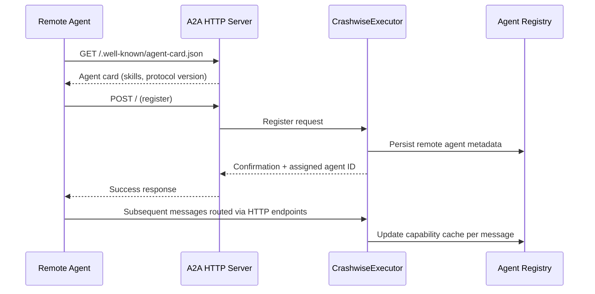
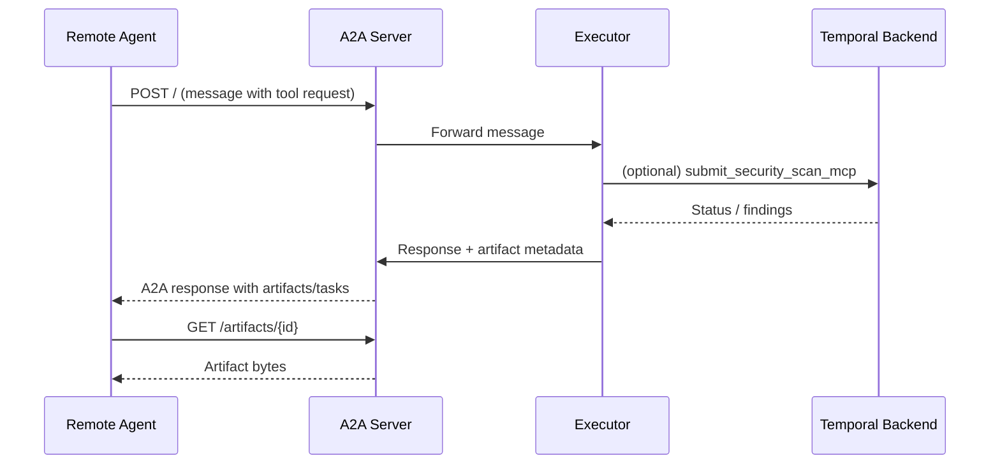

# A2A Services

The Crashwise AI module can expose itself as an Agent-to-Agent (A2A) server so downstream systems can register the agent, inspect its card, and call tools over HTTP.

## Starting the Server

```bash
crashwise ai server
```

Run the command from a project directory that already contains `.crashwise/`. The server reads the project configuration and reuses the same environment variables as the CLI shell.

**Default directories**
- Logs: `.crashwise/logs/cognee.log`
- Cognee datasets: `.crashwise/cognee/project_<id>/{data,system}`
- Artifact cache: `.crashwise/artifacts`

## HTTP Endpoints

| Method | Path | Purpose |
| --- | --- | --- |
| `GET` | `/artifacts/{id}` | Download artifacts created by the agent, workflows, or remote collaborators |
| `POST` | `/graph/query` | Query the Cognee project graph using `query`, optional `dataset`, and optional `search_type` |
| `POST` | `/project/files` | Mirror a file from the project workspace as a downloadable artifact |

### `POST /graph/query`

Request body:
- `query` *(str, required)* – Natural language question for the graph
- `search_type` *(str, optional)* – e.g. `GRAPH_COMPLETION`, `INSIGHTS`, `CHUNKS`
- `dataset` *(str, optional)* – Defaults to `<project>_codebase`

Example:

```bash
curl -s http://localhost:10100/graph/query \
  -H 'Content-Type: application/json' \
  -d '{"query":"unsafe Rust", "search_type":"GRAPH_COMPLETION"}' | jq
```

### `POST /project/files`

Registers a source file and returns an artifact descriptor.

```bash
curl -s http://localhost:10100/project/files \
  -H 'Content-Type: application/json' \
  -d '{"path":"src/lib.rs"}' | jq
```

Response excerpt:

```json
{
  "id": "project_file_4325a8a6",
  "file_uri": "http://127.0.0.1:10100/artifacts/project_file_4325a8a6",
  "name": "src/lib.rs",
  "mime_type": "text/x-c",
  "size": 160
}
```

## Typical Collaboration Flow

1. Ingest project knowledge with `crashwise rag ingest --path . --recursive`.
2. Start the A2A server: `crashwise ai server`.
3. Downstream agents:
   - Call `POST /graph/query` to explore project knowledge.
   - Call `POST /project/files` to fetch raw files from the repository.
   - Download finished scan summaries with `GET /artifacts/{id}`.
4. The AI module pushes Temporal workflow results into artifacts automatically, so remote agents can poll without re-running scans.

## Registration Flow



### How registration works

1. **Discovery** – A remote agent fetches `/.well-known/agent-card.json` to confirm skills, protocol version, and message schemas.
2. **Handshake** – The remote agent issues `POST /` to start the A2A session. The payload includes its agent card and callback URL.
3. **Persistence** – `CrashwiseExecutor` stores the remote agent in the registry (`agents.yaml` when run via the CLI). Auto-registration on future boots replays these entries.
4. **Capability cache** – Each inbound message updates the capability cache so the router can route `ROUTE_TO AgentName:` commands without another round-trip.
5. **Teardown** – Removing an agent via `/unregister` purges it from the registry; restart the server to drop any lingering connections.

### Where agent metadata lives

- The AI CLI and server share the same registry file. When a project is initialised, registrations are written to `.crashwise/agents.yaml` (see `ai/src/Crashwise/config_manager.py`).
- If the project file is absent, the executor falls back to the packaged default at `ai/src/Crashwise/config.yaml`.
- Each entry records `name`, `url`, and description. On startup `_auto_register_agents()` replays that list so both the CLI and the A2A server automatically reconnect to known peers.
- Editing `.crashwise/agents.yaml` manually is supported; the CLI `/register` and `/unregister` commands update it for you.

## Agent Card

The server exposes its agent card at `/.well-known/agent-card.json`. Clients can read that metadata to confirm skills, supported message schemas, and protocol version (`0.3.0`).

## Artifacts in A2A mode

- **Creation** – Conversations generate artifacts automatically when the executor produces code, reports, or workflow summaries. The `/artifacts` CLI command lists them; over HTTP they are addressed by `GET /artifacts/{id}`.
- **Distribution** – Use `/sendfile <agent> <path> [note]` in the CLI or call `POST /project/files` programmatically to turn a project file into an artifact that downstream agents can fetch.
- **Download** – Remote agents receive the artifact descriptor (including `file_uri`) in A2A responses or via polling. Retrieve the content with `GET /artifacts/{id}`; the cache lives under `.crashwise/artifacts/`.
- **Lifecycle** – Artifacts persist for the life of the project workspace. Clean the directory if you need to reclaim space; the executor recreates entries on demand.

## Running the server vs. CLI-only mode

- Launch the server with `crashwise ai server`. It loads `.crashwise/.env`, sets up Cognee directories via `ProjectConfigManager`, and exposes HTTP endpoints on `127.0.0.1:${CRASHWISE_PORT:-10100}`.
- Without the server, the `crashwise ai agent` CLI still supports A2A-style routing for locally registered peers, but external agents cannot connect because the HTTP surface is absent.
- When the server is running, both the CLI and remote agents share the same executor, task store, and artifact cache. Stopping the server returns the module to CLI-only operation without altering persisted registrations.

## Communication Patterns



This pattern repeats for subsequent tool invocations. Remote agents can also call the helper endpoints (`/graph/query`, `/project/files`) directly while the conversation is active.

## Related Files

- Runtime entry point: `ai/src/Crashwise/__main__.py`
- HTTP implementation: `ai/src/Crashwise/a2a_server.py`
- Agent metadata: `ai/src/Crashwise/agent_card.py`
