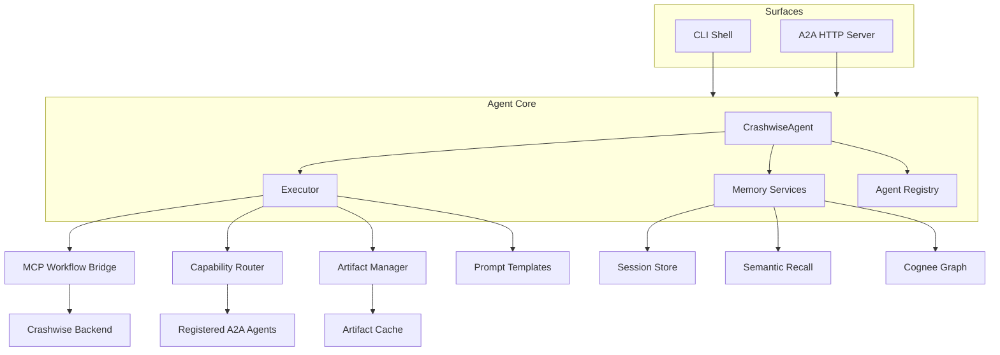
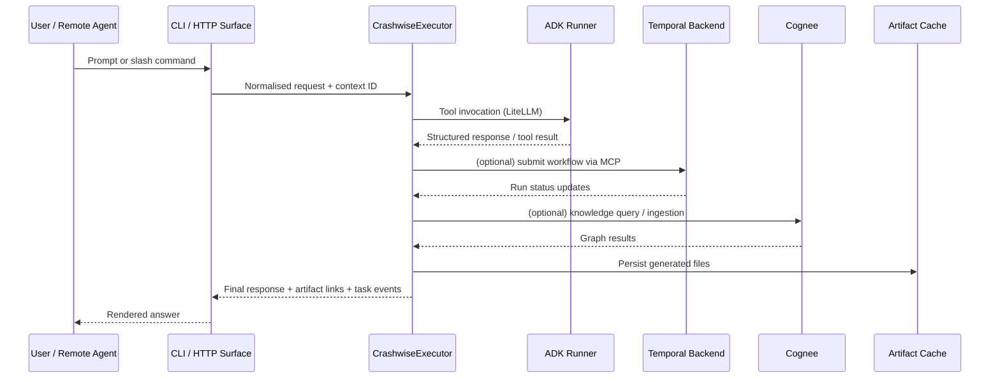
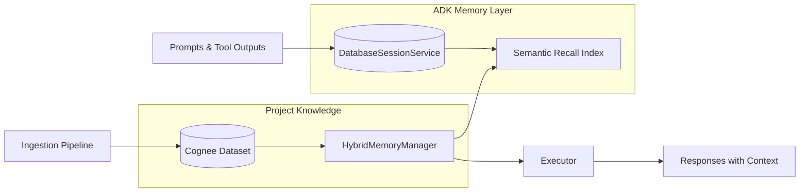

# AI Architecture

Crashwise AI is the orchestration layer that lets large language models drive the broader security platform. Built on the Google ADK runtime, the module coordinates local tools, remote Agent-to-Agent (A2A) peers, and Temporal-backed workflows while persisting long-running context for every project.

## System Diagram

## Detailed Data Flow

## Entry Points

- **CLI shell** (`ai/src/Crashwise/cli.py`) provides the interactive `crashwise ai agent` loop. It streams user messages through the executor, wires slash commands for listing agents, sending files, and launching workflows, and keeps session IDs in sync with ADK’s session service.
- **A2A HTTP server** (`ai/src/Crashwise/a2a_server.py`) wraps the same agent in Starlette. It exposes RPC-compatible endpoints plus helper routes (`/artifacts/{id}`, `/graph/query`, `/project/files`) and reuses the executor’s task store so downstream agents can poll status updates.

## Core Components

- **CrashwiseAgent** (`ai/src/Crashwise/agent.py`) assembles the runtime: it loads environment variables, constructs the executor, and builds an ADK `Agent` backed by `LiteLlm`. The singleton accessor `get_crashwise_agent()` keeps CLI and server instances aligned and shares the generated agent card.
- **CrashwiseExecutor** (`ai/src/Crashwise/agent_executor.py`) is the brain. It registers tools, manages session storage (SQLite or in-memory via `DatabaseSessionService` / `InMemorySessionService`), and coordinates artifact storage. The executor also tracks long-running Temporal workflows inside `pending_runs`, produces `TaskStatusUpdateEvent` objects, and funnels every response through ADK’s `Runner` so traces include tool metadata.
- **Remote agent registry** (`ai/src/Crashwise/remote_agent.py`) holds metadata for downstream agents and handles capability discovery over HTTP. Auto-registration is configured by `ConfigManager` so known agents attach on startup.
- **Memory services**:
  - `CrashwiseMemoryService` and `HybridMemoryManager` (`ai/src/Crashwise/memory_service.py`) provide conversation recall and bridge to Cognee datasets when configured.
  - Cognee bootstrap (`ai/src/Crashwise/cognee_service.py`) ensures ingestion and knowledge queries stay scoped to the current project.

## Workflow Automation

The executor wraps Temporal MCP actions exposed by the backend:

| Tool | Source | Purpose |
| --- | --- | --- |
| `list_workflows_mcp` | `ai/src/Crashwise/agent_executor.py` | Enumerate available scans |
| `submit_security_scan_mcp` | `agent_executor.py` | Launch a scan and persist run metadata |
| `get_run_status_mcp` | `agent_executor.py` | Poll Temporal for status and push task events |
| `get_comprehensive_scan_summary` | `agent_executor.py` | Collect findings and bundle artifacts |
| `get_backend_status_mcp` | `agent_executor.py` | Block submissions until Temporal reports `ready` |

The CLI surface mirrors these helpers as natural-language prompts (`You> run crashwise workflow …`). ADK’s `Runner` handles retries and ensures each tool call yields structured `Event` objects for downstream instrumentation.

## Knowledge & Ingestion

- The `crashwise ingest` and `crashwise rag ingest` commands call into `ai/src/Crashwise/ingest_utils.py`, which filters file types, ignores caches, and populates Cognee datasets under `.crashwise/cognee/project_<id>/`.
- Runtime queries hit `query_project_knowledge_api` on the executor, which defers to `cognee_service` for dataset lookup and semantic search. When Cognee credentials are absent the tools return a friendly "not configured" response.

## Artifact Pipeline

Artifacts generated during conversations or workflow runs are written to `.crashwise/artifacts/`:

1. The executor creates a unique directory per artifact ID and writes the payload (text, JSON, or binary).
2. Metadata is stored in-memory and, when running under the A2A server, surfaced via `GET /artifacts/{id}`.
3. File uploads from `/project/files` reuse the same pipeline so remote agents see a consistent interface.

## Task & Event Wiring

- In CLI mode, `CrashwiseExecutor` bootstraps shared `InMemoryTaskStore` and `InMemoryQueueManager` instances (see `agent_executor.py`). They allow the agent to emit `TaskStatusUpdateEvent` objects even when the standalone server is not running.
- The A2A HTTP wrapper reuses those handles, so any active workflow is visible to both the local shell and remote peers.

Use the complementary docs for step-by-step instructions:

- [Ingestion & Knowledge Graphs](ingestion.md)
- [LLM & Environment Configuration](configuration.md)
- [Prompt Patterns & Examples](prompts.md)
- [A2A Services](a2a-services.md)

## Memory & Persistence

- **Session persistence** is controlled by `SESSION_PERSISTENCE`. When set to `sqlite`, ADK’s `DatabaseSessionService` writes transcripts to the path configured by `SESSION_DB_PATH` (defaults to `./crashwise_sessions.db`). With `inmemory`, the context is scoped to the current process.
- **Semantic recall** stores vector embeddings so `/recall` queries can surface earlier prompts, even after restarts when using SQLite.
- **Hybrid memory manager** (`HybridMemoryManager`) stitches Cognee results into the ADK session. When a knowledge query hits Cognee, the relevant nodes are appended back into the session context so follow-up prompts can reference them naturally.
- **Cognee datasets** are unique per project. Ingestion runs populate `<project>_codebase` while custom calls to `ingest_to_dataset` let you maintain dedicated buckets (e.g., `insights`). Data is persisted inside `.crashwise/cognee/project_<id>/` and shared across CLI and A2A modes.
- **Task metadata** (workflow runs, artifact descriptors) lives in the executor’s in-memory caches but is also mirrored through A2A task events so remote agents can resubscribe if the CLI restarts.
- **Operational check**: Run `/recall <keyword>` or `You> search project knowledge for "topic" using INSIGHTS` after ingestion to confirm both ADK session recall and Cognee graph access are active.
- **CLI quick check**: `/memory status` summarises the current memory type, session persistence, and Cognee dataset directories from inside the agent shell.
