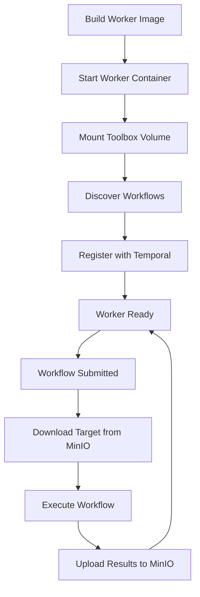

# Docker Containers in Crashwise: Concept and Design

Docker containers are at the heart of Crashwise’s execution model. They provide the isolation, consistency, and flexibility needed to run security workflows reliably—no matter where Crashwise is deployed. This page explains the core concepts behind container usage in Crashwise, why containers are used, and how they shape the platform’s behavior.

---

## Why Use Docker Containers?

Crashwise relies on Docker containers for several key reasons:

- **Isolation:** Each workflow runs in its own container, so tools and processes can’t interfere with each other or the host.
- **Consistency:** The environment inside a container is always the same, regardless of the underlying system.
- **Security:** Containers restrict access to host resources and run as non-root users.
- **Reproducibility:** Results are deterministic, since the environment is controlled and versioned.
- **Scalability:** Containers can be started, stopped, and scaled up or down as needed.

---

## How Does Crashwise Use Containers?

### The Container Model

Every workflow in Crashwise is executed inside a Docker container. Here’s what that means in practice:

- **Vertical worker containers** are built from language-specific base images with domain-specific security toolchains pre-installed (Android, Rust, Web, etc.).
- **Infrastructure containers** (API server, Temporal, MinIO, database) use official images and are configured for the platform's needs.

### Worker Lifecycle: From Build to Long-Running

The lifecycle of a vertical worker looks like this:

1. **Image Build:** A Docker image is built with all required toolchains for the vertical.
2. **Worker Start:** The worker container starts as a long-lived process.
3. **Workflow Discovery:** Worker scans mounted `/app/toolbox` for workflows matching its vertical.
4. **Registration:** Workflows are registered with Temporal on the worker's task queue.
5. **Execution:** When a workflow is submitted, the worker downloads the target from MinIO and executes.
6. **Continuous Running:** Worker remains running, ready for the next workflow.



---

## What's Inside a Vertical Worker Container?

A typical vertical worker container is structured like this:

- **Base Image:** Language-specific image (e.g., `python:3.11-slim`).
- **System Dependencies:** Installed as needed (e.g., `git`, `curl`).
- **Domain-Specific Toolchains:** Pre-installed (e.g., Rust: `AFL++`, `cargo-fuzz`; Android: `apktool`, `Frida`).
- **Temporal Python SDK:** For workflow execution.
- **Boto3:** For MinIO/S3 access.
- **Worker Script:** Discovers and registers workflows.
- **Non-root User:** Created for execution.
- **Entrypoint:** Runs the worker discovery and registration loop.

Example Dockerfile snippet for Rust worker:

```dockerfile
FROM python:3.11-slim
RUN apt-get update && apt-get install -y git curl build-essential && rm -rf /var/lib/apt/lists/*
# Install AFL++, cargo, etc.
RUN pip install temporalio boto3 pydantic
COPY worker.py /app/
WORKDIR /app
RUN useradd -m -u 1000 crashwise
USER crashwise
# Toolbox will be mounted as volume at /app/toolbox
CMD ["python", "worker.py"]
```

---

## How Are Containers Networked and Connected?

- **Docker Compose Network:** All containers are attached to a custom bridge network for internal communication.
- **Internal DNS:** Services communicate using Docker Compose service names.
- **Port Exposure:** Only necessary ports are exposed to the host.
- **Network Isolation:** Workflow containers are isolated from infrastructure containers when possible.

Example network config:

```yaml
networks:
  crashwise:
    driver: bridge
    ipam:
      config:
        - subnet: 172.20.0.0/16
```

---

## How Is Data Managed with Volumes?

### Volume Types

- **Toolbox Volume:** Mounts the workflow code directory, read-only, for dynamic discovery.
- **Worker Cache:** Local cache for downloaded MinIO targets, with LRU eviction.
- **MinIO Data:** Persistent storage for uploaded targets and results (S3-compatible).

Example volume mount:

```yaml
volumes:
  - "./toolbox:/app/toolbox:ro"  # Workflow code
  - "worker_cache:/cache"         # Local cache
  - "minio_data:/data"            # MinIO storage
```

### Volume Security

- **Read-only Toolbox:** Workflows cannot modify the mounted toolbox code.
- **Isolated Storage:** Each workflow's target is stored with a unique `target_id` in MinIO.
- **No Host Filesystem Access:** Workers access targets via MinIO, not host paths.
- **Automatic Cleanup:** MinIO lifecycle policies delete old targets after 7 days.

---

## How Are Worker Images Built and Managed?

- **Automated Builds:** Vertical worker images are built with specialized toolchains.
- **Build Optimization:** Use layer caching, multi-stage builds, and minimal base images.
- **Versioning:** Use tags (`latest`, semantic versions) to track worker images.
- **Long-Lived:** Workers run continuously, not ephemeral per-workflow.

Example build:

```bash
cd workers/rust
docker build -t crashwise-worker-rust:latest .
# Or via docker-compose
docker-compose -f docker-compose.yml build worker-rust
```

---

## How Are Resources Controlled?

- **Memory and CPU Limits:** Set per container to prevent resource exhaustion.
- **Resource Monitoring:** Use `docker stats` and platform APIs to track usage.
- **Alerts:** Detect and handle out-of-memory or CPU throttling events.

Example resource config:

```yaml
services:
  worker-rust:
    deploy:
      resources:
        limits:
          memory: 4G
          cpus: '2.0'
        reservations:
          memory: 1G
          cpus: '0.5'
    environment:
      MAX_CONCURRENT_ACTIVITIES: 5
```

---

## How Is Security Enforced?

- **Non-root Execution:** Containers run as a dedicated, non-root user.
- **Capability Restrictions:** Drop unnecessary Linux capabilities.
- **Filesystem Protection:** Use read-only filesystems and tmpfs for temporary data.
- **Network Isolation:** Restrict network access to only what’s needed.
- **No Privileged Mode:** Containers never run with elevated privileges.

Example security options:

```yaml
services:
  worker-rust:
    security_opt:
      - no-new-privileges:true
    cap_drop:
      - ALL
    cap_add:
      - CHOWN
      - SETGID
      - SETUID
```

---

## How Is Performance Optimized?

- **Image Layering:** Structure Dockerfiles for efficient caching.
- **Pre-installed Toolchains:** All tools installed in worker image, zero setup time per workflow.
- **Long-Lived Workers:** Eliminate container startup overhead entirely.
- **Local Caching:** MinIO targets cached locally for repeated workflows.
- **Horizontal Scaling:** Scale worker containers to handle more workflows in parallel.

---

## How Are Containers Monitored and Debugged?

- **Health Checks:** Each service and workflow container has a health endpoint or check.
- **Logging:** All container logs are collected and can be accessed via `docker logs` or the Crashwise API.
- **Debug Access:** Use `docker exec` to access running containers for troubleshooting.
- **Resource Stats:** Monitor with `docker stats` or platform dashboards.

---

## How Does This All Fit Into Crashwise?

- **Temporal Workers:** Long-lived vertical workers execute workflows with pre-installed toolchains.
- **API Integration:** Exposes workflow status, logs, and resource metrics via Temporal.
- **MinIO Storage:** Ensures targets and results are stored, cached, and cleaned up automatically.
- **Security and Resource Controls:** Enforced automatically for every worker and workflow.

---

## In Summary

Docker containers are the foundation of Crashwise’s execution model. They provide the isolation, security, and reproducibility needed for robust security analysis workflows—while making it easy to scale, monitor, and extend the platform.
