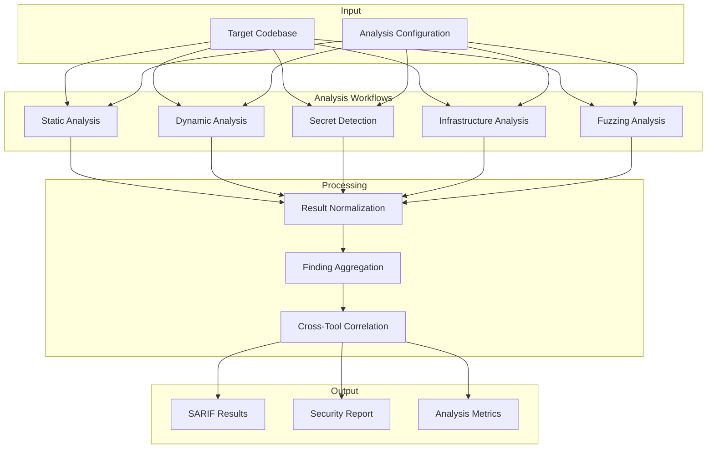

# Security Analysis in Crashwise: Concepts and Approach

Security analysis is at the core of Crashwise’s mission. This page explains the philosophy, methodologies, and integration patterns that shape how Crashwise discovers vulnerabilities and helps teams secure their software. If you’re curious about what “security analysis” really means in this platform—and why it’s designed this way—read on.

---

## Why Does Crashwise Approach Security Analysis This Way?

Crashwise’s security analysis is built on a few guiding principles:

- **Defense in Depth:** No single tool or method catches everything. Crashwise layers multiple analysis types—static, dynamic, secret detection, infrastructure checks, and fuzzing—to maximize coverage.
- **Tool Diversity:** Different tools find different issues. Running several tools for each analysis type reduces blind spots and increases confidence in results.
- **Standardized Results:** All findings are normalized into SARIF, a widely adopted format. This makes results easy to aggregate, review, and integrate with other tools.
- **Automation and Integration:** Security analysis is only useful if it fits into real-world workflows. Crashwise is designed for CI/CD, developer feedback, and automated reporting.

---

## What Types of Security Analysis Does Crashwise Perform?

### Static Analysis

- **What it is:** Examines source code without running it, looking for vulnerabilities, anti-patterns, and risky constructs.
- **How it works:** Parses code, analyzes control and data flow, and matches patterns against known vulnerabilities.
- **Tools:** Semgrep, Bandit, CodeQL, ESLint, and more.
- **Strengths:** Fast, broad coverage, no runtime needed.
- **Limitations:** Can’t see runtime issues, may produce false positives.

### Dynamic Analysis

- **What it is:** Tests running applications to find vulnerabilities that only appear at runtime.
- **How it works:** Deploys the app in a test environment, probes entry points, and observes behavior under attack.
- **Tools:** Nuclei, OWASP ZAP, Nmap, SQLMap.
- **Strengths:** Finds real, exploitable issues; validates actual behavior.
- **Limitations:** Needs a working environment; slower; may not cover all code.

### Secret Detection

- **What it is:** Scans code and configuration for exposed credentials, API keys, and sensitive data.
- **How it works:** Uses pattern matching, entropy analysis, and context checks—sometimes even scanning git history.
- **Tools:** TruffleHog, Gitleaks, detect-secrets, GitGuardian.
- **Strengths:** Fast, critical for preventing leaks.
- **Limitations:** Can’t find encrypted/encoded secrets; needs regular pattern updates.

### Infrastructure Analysis

- **What it is:** Analyzes infrastructure-as-code, container configs, and deployment manifests for security misconfigurations.
- **How it works:** Parses config files, applies security policies, checks compliance, and assesses risk.
- **Tools:** Checkov, Hadolint, Kubesec, Terrascan.
- **Strengths:** Prevents misconfigurations before deployment; automates compliance.
- **Limitations:** Can’t see runtime changes; depends on up-to-date policies.

### Fuzzing

- **What it is:** Automatically generates and sends unexpected or random inputs to code, looking for crashes or unexpected behavior.
- **How it works:** Identifies targets, generates inputs, monitors execution, and analyzes crashes.
- **Tools:** AFL++, libFuzzer, Cargo Fuzz, Jazzer.
- **Strengths:** Finds deep, complex bugs; great for memory safety.
- **Limitations:** Resource-intensive; may need manual setup.

### Comprehensive Assessment

- **What it is:** Combines all the above for a holistic view, correlating findings and prioritizing risks.
- **How it works:** Runs multiple analyses, aggregates and correlates results, and generates unified reports.
- **Benefits:** Complete coverage, better context, prioritized remediation, and compliance support.

---

## How Does Crashwise Integrate and Orchestrate Analysis?

### Workflow Composition

Crashwise composes analysis workflows by combining different analysis types, each running in its own containerized environment. Inputs (code, configs, parameters) are fed into the appropriate tools, and results are normalized and aggregated.

### Orchestration Patterns

- **Parallel Execution:** Tools of the same type (e.g., multiple static analyzers) run in parallel for speed and redundancy.
- **Sequential Execution:** Some analyses depend on previous results (e.g., dynamic analysis using endpoints found by static analysis).
- **Result Normalization:** All findings are converted to SARIF for consistency.
- **Correlation:** Related findings from different tools are grouped and prioritized.

---

## How Is Quality Ensured?

### Metrics and Measurement

- **Coverage:** How much code, how many rules, and how many vulnerability types are analyzed.
- **Accuracy:** False positive/negative rates, confidence scores, and validation rates.
- **Performance:** Analysis duration, resource usage, and scalability.

### Quality Assurance

- **Cross-Tool Validation:** Findings are confirmed by multiple tools when possible.
- **Manual Review:** High-severity findings can be flagged for expert review.
- **Continuous Improvement:** Tools and rules are updated regularly, and user feedback is incorporated.

---

## How Does Security Analysis Fit Into Development Workflows?

### CI/CD Integration

- **Pre-commit Hooks:** Run security checks before code is committed.
- **Pipeline Integration:** Block deployments if high/critical issues are found.
- **Quality Gates:** Enforce severity thresholds and track trends over time.

### Developer Experience

- **IDE Integration:** Import SARIF findings into supported IDEs for inline feedback.
- **Real-Time Analysis:** Optionally run background checks during development.
- **Reporting:** Executive dashboards, technical reports, and compliance summaries.

---

## What’s Next for Security Analysis in Crashwise?

Crashwise is designed to evolve. Advanced techniques like machine learning for pattern recognition, contextual analysis, and business logic checks are on the roadmap. The goal: keep raising the bar for automated, actionable, and developer-friendly security analysis.

---

## In Summary

Crashwise’s security analysis is comprehensive, layered, and designed for real-world integration. By combining multiple analysis types, normalizing results, and focusing on automation and developer experience, Crashwise helps teams find and fix vulnerabilities—before attackers do.
