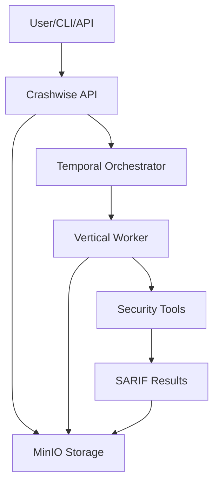

# Understanding Workflows in Crashwise

Workflows are the backbone of Crashwise’s security analysis platform. If you want to get the most out of Crashwise, it’s essential to understand what workflows are, how they’re designed, and how they operate from start to finish. This page explains the core concepts, design principles, and execution models behind Crashwise workflows—so you can use them confidently and effectively.

---

## What Is a Workflow?

A **workflow** in Crashwise is a containerized process that orchestrates one or more security tools to analyze a target codebase or application. Each workflow is tailored for a specific type of security analysis (like static analysis, secret detection, or fuzzing) and is designed to be:

- **Isolated:** Runs in its own Docker container for security and reproducibility.
- **Integrated:** Can combine multiple tools for comprehensive results.
- **Standardized:** Always produces SARIF-compliant output.
- **Configurable:** Accepts parameters to customize analysis.
- **Scalable:** Can run in parallel and scale horizontally.

---

## How Does a Workflow Operate?

### High-Level Architecture

Here’s how a workflow moves through the Crashwise system:

**Key roles:**
- **User/CLI/API:** Submits workflows and uploads files.
- **Crashwise API:** Validates, uploads targets, and tracks workflows.
- **Temporal Orchestrator:** Schedules and manages workflow execution.
- **Vertical Worker:** Long-lived worker with pre-installed security tools.
- **MinIO Storage:** Stores uploaded targets and results.
- **Security Tools:** Perform the actual analysis.

---

## Workflow Lifecycle: From Idea to Results

1. **Design:** Choose tools, define integration logic, set up parameters, and specify the vertical worker.
2. **Deployment:** Create workflow code, add metadata with `vertical` field, mount as volume in worker.
3. **Execution:** User submits a workflow with file upload; file is stored in MinIO; workflow is routed to vertical worker; worker downloads target and executes; tools run as designed.
4. **Completion:** Results are collected, normalized, and stored in MinIO; status is updated; MinIO lifecycle policies clean up old files; results are made available via API/CLI.

---

## Types of Workflows

Crashwise supports several workflow types, each optimized for a specific security need:

- **Static Analysis:** Examines source code without running it (e.g., Semgrep, Bandit).
- **Dynamic Analysis:** Tests running applications for runtime vulnerabilities (e.g., OWASP ZAP, Nuclei).
- **Secret Detection:** Finds exposed credentials and sensitive data (e.g., TruffleHog, Gitleaks).
- **Infrastructure Analysis:** Checks infrastructure-as-code and configs for misconfigurations (e.g., Checkov, Hadolint).
- **Fuzzing:** Generates unexpected inputs to find crashes and edge cases (e.g., AFL++, libFuzzer).
- **Comprehensive Assessment:** Combines multiple analysis types for full coverage.

---

## Workflow Design Principles

- **Tool Agnostic:** Workflows abstract away the specifics of underlying tools, providing a consistent interface.
- **Fail-Safe Execution:** If one tool fails, others continue—partial results are still valuable.
- **Configurable:** Users can adjust parameters to control tool behavior, output, and execution.
- **Resource-Aware:** Workflows specify and respect resource limits (CPU, memory).
- **Standardized Output:** All results are normalized to SARIF for easy integration and reporting.

---

## Execution Models

- **Synchronous:** Wait for the workflow to finish and get results immediately—great for interactive use.
- **Asynchronous:** Submit a workflow and check back later for results—ideal for long-running or batch jobs.
- **Parallel:** Run multiple workflows at once for comprehensive or time-sensitive analysis.

---

## Data Flow and Storage

- **Input:** Target files uploaded via HTTP to MinIO; parameters validated and passed to Temporal.
- **Processing:** Worker downloads target from MinIO to local cache; tools are initialized and run (often in parallel); outputs are collected and normalized.
- **Output:** Results are stored in MinIO and indexed for fast retrieval; metadata is saved in PostgreSQL; targets cached locally for repeated workflows; lifecycle policies clean up after 7 days.

---

## Error Handling and Recovery

- **Tool-Level:** Timeouts, resource exhaustion, and crashes are handled gracefully; failed tools don't stop the workflow.
- **Workflow-Level:** Worker failures, storage issues, and network problems are detected and reported by Temporal.
- **Recovery:** Automatic retries for transient errors via Temporal; partial results are returned when possible; workflows degrade gracefully if some tools are unavailable; MinIO ensures targets remain accessible.

---

## Performance and Optimization

- **Worker Efficiency:** Long-lived workers eliminate container startup overhead; pre-installed toolchains reduce setup time.
- **Parallel Processing:** Independent tools run concurrently to maximize CPU usage and minimize wait times.
- **Caching:** MinIO targets are cached locally; repeated workflows reuse cached targets; worker cache uses LRU eviction.

---

## Monitoring and Observability

- **Metrics:** Track execution time, resource usage, and success/failure rates.
- **Logging:** Structured logs and tool outputs are captured for debugging and analysis.
- **Real-Time Monitoring:** Live status updates and progress indicators are available via API/WebSocket.

---

## Integration Patterns

- **CI/CD:** Integrate workflows into pipelines to block deployments on critical findings.
- **API:** Programmatically submit and track workflows from your own tools or scripts.
- **Event-Driven:** Use webhooks or event listeners to trigger actions on workflow completion.

---

## In Summary

Workflows in Crashwise are designed to be robust, flexible, and easy to integrate into your security and development processes. By combining containerization, orchestration, and a standardized interface, Crashwise workflows help you automate and scale security analysis—so you can focus on fixing issues, not just finding them.
